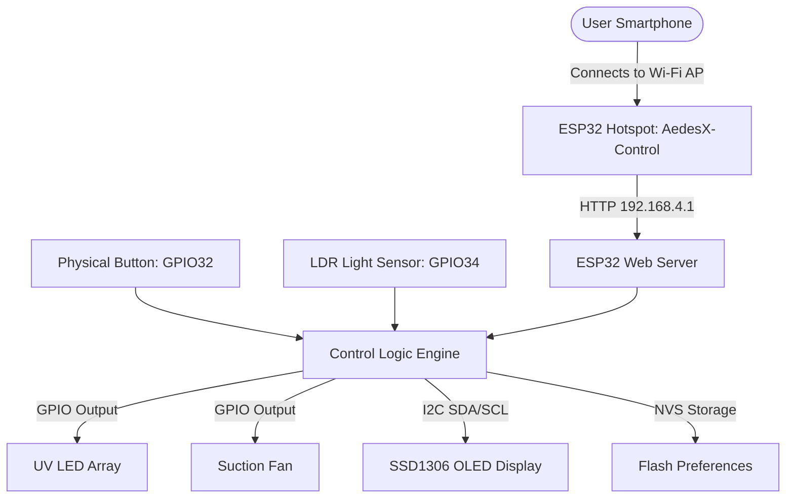
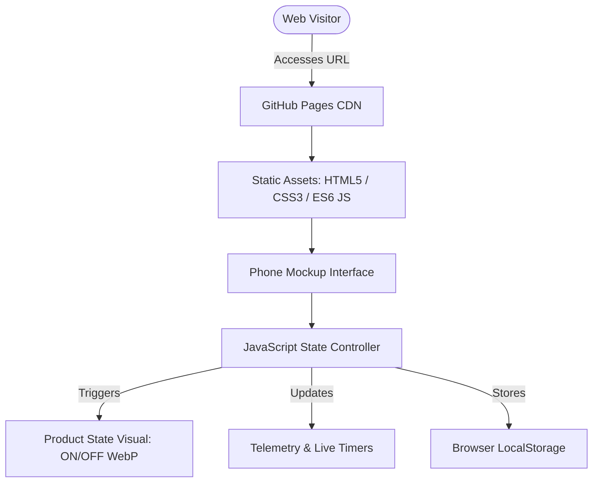

# AEDES-X
**Smart Mosquito Control System**

[](https://shamsirismail.github.io/aedes-x-dashboard-demo/)
[](https://shamsirismail.github.io/aedes-x-dashboard-demo/)
[](#license)

> An interactive dual-viewport portfolio presentation showcasing the **AEDES-X ESP32 Smart Mosquito Trap**. Test the mobile dashboard on the left and observe real-time visual feedback of the physical prototype on the right.

---

## 🌐 Interactive Live Demo

Experience the full interactive simulation directly in your browser without hardware:

👉 **[Launch AEDES-X Live Demo](https://shamsirismail.github.io/aedes-x-dashboard-demo/)**  
`https://shamsirismail.github.io/aedes-x-dashboard-demo/`

---

## 📋 Project Overview

**AEDES-X** is an IoT-enabled smart eco-trap engineered to target and mitigate *Aedes aegypti* and *Aedes albopictus* mosquito vectors (carriers of Dengue, Zika, and Chikungunya). 

By synchronizing targeted UV LED attractants, CO₂ fermentation lure, and a suction trap with biological mosquito peak biting windows (dawn and dusk) and light conditions, AEDES-X delivers automated pest suppression while conserving energy.

This repository hosts the **public interactive portfolio demo**, allowing reviewers, interviewers, and colleagues to test the complete user experience, control logic, and visual states directly in their web browser.

---

## ⚖️ Real Prototype vs Browser Demo

| Aspect | Real ESP32 Hardware Prototype | Public Browser Portfolio Demo |
|---|---|---|
| **Platform** | ESP32-WROOM-32 microcontroller | Pure Static Web (HTML5 / Vanilla CSS / ES6 JS) |
| **Hosting** | Local Wi-Fi Access Point (`AedesX-Control`) | GitHub Pages CDN |
| **Control Logic** | C++ / Arduino firmware running on ESP32 | JavaScript state machine mirroring firmware logic |
| **Hardware Output** | Real GPIO switching 12V Fan & UV LEDs | High-resolution real product photography (ON/OFF states) |
| **Light Sensing** | Physical analog LDR sensor on GPIO34 | Interactive ambient light simulator slider |
| **Display** | 0.96" SSD1306 I2C OLED Display | Live telemetry cards inside phone mockup & product card |
| **Mode Switching** | Physical tactile pushbutton on GPIO32 | Virtual physical button + dashboard mode pills |
| **Schedule / Clock** | ESP32 internal RTC / SNTP | Browser clock + fast-forward demo time slider |
| **Data Persistence** | Non-volatile storage (ESP32 Preferences / NVS) | Browser `localStorage` (language, maintenance intervals) |
| **Remote Control** | Local captive portal / 192.168.4.1 | Independent browser simulation (no cloud backend required) |

> [!NOTE]
> **Simulation Transparency**: This public web demo simulates the ESP32 state and firmware logic entirely client-side in the browser. It does not remotely control live physical hardware over the cloud.

---

## ✨ Key Features

- **Split Interactive Experience**: Phone mockup with touch-ready UI on the left; authentic product photography responding to commands on the right.
- **Three Intelligent Operating Modes**:
  - **Manual Mode**: Direct on/off override.
  - **Auto LDR Mode**: Day/night illumination-triggered activation with software hysteresis to prevent rapid cycling at twilight.
  - **Timer Mode**: Automated operation synchronized with mosquito peak activity windows:
    - **Dawn Window**: `05:30 – 07:30` (2 hours)
    - **Dusk Window**: `18:00 – 19:30` (1.5 hours)
- **Safety Interlock (Virtual Main Switch)**: Simulates the physical hardware power switch, locking all controls when turned OFF.
- **Bilingual Support (BM / EN)**: Instant switching between Bahasa Melayu and English across all UI labels and status toasts.
- **Interactive Light Simulator**: Test LDR sensitivity (0–4095 ADC) with real-time threshold visualization (`OFF ≤ 1800` · `ON ≥ 2100`).
- **Demo Time Warp**: Fast-forward to dawn (06:15), day (12:00), dusk (18:30), or night (22:00) to test scheduled triggers without waiting.
- **Consumable & Maintenance Tracker**: Tracks replacement cycles for CO₂ yeast-sugar mixture and mesh debris cleaning.

---

## 🏗️ System Architecture

### 1. Real Hardware Prototype Architecture


### 2. Public Browser Demo Architecture


---

## 🔌 Hardware Components & GPIO Mapping

| Component | Specification | GPIO Pin | Description |
|---|---|---|---|
| **MCU** | ESP32-WROOM-32 (38-pin DevKit) | — | Main dual-core microcontroller & Wi-Fi AP |
| **Optical Attractant** | 395nm Near-UV High-Power LEDs | `GPIO 25` | Mosquito phototaxis attractant |
| **Suction Subsystem** | 12V Brushless DC Blower Fan | `GPIO 26` | Traps mosquitoes into catch container |
| **Light Sensor** | Photoresistor (LDR) Voltage Divider | `GPIO 34` | ADC analog input for ambient darkness detection |
| **Tactile Pushbutton** | Momentary Push Button with Pull-Up | `GPIO 32` | Physical mode cycler (Manual → Auto → Timer) |
| **OLED Display** | 0.96" SSD1306 128×64 Monochrome | `GPIO 21` (SDA) / `GPIO 22` (SCL) | Local real-time status display |
| **Power Switch** | SPST Rocker Switch | `GPIO 33` | Master power / safety lockout interlock |

---

## 🕹️ Operating Modes & Control Logic

### 1. Manual Mode (`Mode 0`)
Allows direct manual override via the dashboard:
- Tap **TURN ON** or **TURN OFF**.
- Immediate visual activation of UV attractants and suction fan.

### 2. Auto LDR Mode (`Mode 1`)
Activates automatically during low-light conditions:
- **Activation Threshold**: `ADC ≥ 2100` (Dark)
- **Deactivation Threshold**: `ADC ≤ 1800` (Bright)
- **Hysteresis Band**: `300 ADC counts` buffer eliminates relay flutter during sunrise/sunset transitions.

### 3. Timer Mode (`Mode 2`)
Automates trap cycles based on entomological research into peak *Aedes* flight and host-seeking activity:
- **Dawn Peak**: `05:30 – 07:30` (120 minutes)
- **Dusk Peak**: `18:00 – 19:30` (90 minutes)
- Off during non-target periods to preserve fan longevity and reduce power draw.

---

## 🧰 Maintenance Tracking System

AEDES-X includes an integrated maintenance scheduler to ensure peak mosquito catch efficacy:
- **CO₂ Fermentation Mixture**: Yeast and sugar mixture emits CO₂ mimicking human respiration; typically replaced every 14 days.
- **Mesh Basket Cleaning**: Periodic inspection and clearing of collected insects to maintain maximum airflow suction.
- Visual badge indicators: `✓ Good`, `! Due Soon` (within 25% of cycle), or `! Overdue`.

---

## 📸 Visual Assets & Product Preview

The demonstration utilizes high-resolution photographs of the actual 3D-printed prototype:
- [`assets/aedesx-off.webp`](./assets/aedesx-off.webp) — Prototype in powered-down standby state.
- [`assets/aedesx-on.webp`](./assets/aedesx-on.webp) — Prototype operating with UV illumination and active indicator.
- [`assets/aedesx-prototype.webp`](./assets/aedesx-prototype.webp) — Engineering prototype overview.

---

## 💻 Tech Stack

- **HTML5**: Semantic markup with ARIA accessibility labels.
- **Vanilla CSS**: Custom design system, responsive flex/grid layouts, device frame styling, glassmorphism (`backdrop-filter`), and CSS animations.
- **Vanilla ES6 JavaScript**: State machine, interval ticker, hysteresis logic, time warp calculations, and bilingual dictionary.
- **Hosting**: GitHub Pages (Zero-build, zero-serverless, 100% static).

---

## 🚀 Run Locally

No package managers, build steps, or compilers required.

### Option 1: Python
```bash
python -m http.server 8000
```
Open [http://localhost:8000](http://localhost:8000) in your browser.

### Option 2: Node.js
```bash
npx --yes serve -l 8000 .
```

---

## ⚙️ Deploy to GitHub Pages

1. Push this repository to GitHub on branch `main`.
2. In your repository, go to **Settings** → **Pages**.
3. Under **Build and deployment**:
   - **Source**: `Deploy from a branch`
   - **Branch**: `main`
   - **Folder**: `/ (root)`
4. Click **Save**.
5. Wait 1–2 minutes for the deployment workflow to complete.
6. Visit: `https://<username>.github.io/<repository-name>/`

---

## ⚠️ Limitations & Future Improvements

### Current Prototype Limitations
- The real prototype relies on a local AP network rather than cloud MQTT/HTTP bridge.
- The public demo relies on browser clock / simulated time for Timer Mode demonstrations.

### Future Roadmap
- [ ] ESP-NOW mesh networking for multi-trap yard coverage.
- [ ] Low-power sleep modes between active timer windows.
- [ ] Acoustic mosquito detection (wingbeat frequency analysis) for selective capture verification.
- [ ] Solar charging integration with LiFePO4 battery management.

---

## 👤 Author & Contact

**Shamsir Ismail**  
- **GitHub**: [@ShamsirIsmail](https://github.com/ShamsirIsmail)  
- **Project Repository**: [aedes-x-dashboard-demo](https://github.com/ShamsirIsmail/aedes-x-dashboard-demo)  
- **Live Demo**: [https://shamsirismail.github.io/aedes-x-dashboard-demo/](https://shamsirismail.github.io/aedes-x-dashboard-demo/)

---

## 📄 License

This project is licensed under the MIT License — see the repository for details.
